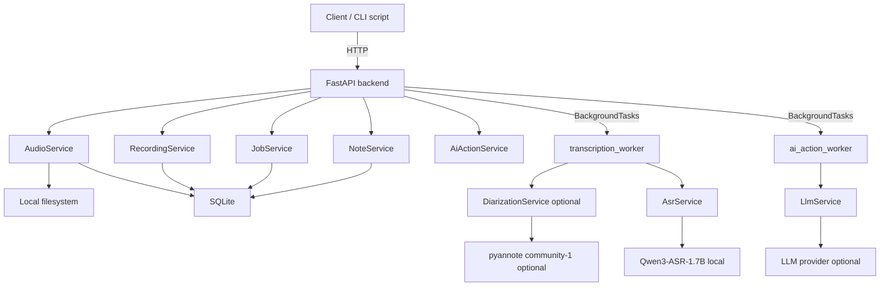

# Architecture

Finch follows a **transcript-first** design: audio becomes a transcript locally; LLM-generated notes are optional derivatives.

```txt
Audio → Recording → Note(s)
```

## High-level view



## Core principle

- **ASR is local.** Audio never leaves the machine for transcription.
- **Diarization is local** when enabled (pyannote). Speaker labels are optional.
- **Transcript is source of truth.** Edits are stored separately (`editedText`).
- **LLM is optional.** Only transcript text is sent to the configured provider for AI actions.

## Data model

```txt
AudioAsset
  ↓
Recording
  ↓
Note(s)
```

| Entity | Purpose |
|--------|---------|
| `AudioAsset` | Uploaded or recorded file metadata + paths to original/normalized WAV |
| `Recording` | `rawText`, optional `editedText`, `speakerSegments`, `status` (`draft` / `final` / `transcribing` / `failed`) |
| `VoiceprintProfile` | Voiceprint profile identity (`displayName`, `notes`) |
| `VoiceprintEmbedding` | Local voiceprint vectors linked to a profile |
| `AppPreference` | Key/value store (transcription settings, voiceprint consent, auto-label toggle, `user_settings` JSON) |
| `Job` | Async work unit (`transcription`, `ai_action`) with progress/stage |
| `Note` | LLM-generated or manual Markdown linked to a recording |

## Request flows

### Upload and normalize

```txt
POST /api/audio/upload
  → validate MIME + size (mp3, wav, webm, m4a, …)
  → save original to data/audio/original/
  → ffmpeg → 16 kHz mono PCM WAV in data/audio/normalized/
  → persist AudioAsset
```

### Transcription job

When diarization is enabled (via **Settings → Transcription** or `.env` fallback):

```txt
POST /api/recordings { audioAssetId }
  → create Recording placeholder (status=transcribing)
  → create Job, resultId = recording.id
  → transcription_worker
       → optional: pyannote diarization → speaker segments
       → optional: voiceprint match → named labels
       → Qwen3-ASR per segment (or full file if diarization off/fallback)
       → update Recording (rawText, speakerSegments, status=draft)
       → Job completed
```

On failure, the recording is kept with `status=failed` and `errorMessage` (not deleted).

If diarization is enabled but unavailable (missing HF access, etc.), the worker falls back to full-file ASR and stores a `processingNote` on the recording.

Segment tuning (`DIARIZATION_MIN_SEGMENT_SECONDS`, `DIARIZATION_MERGE_GAP_SECONDS`, `DIARIZATION_MAX_SEGMENTS`) is applied after pyannote. See [diarization.md](diarization.md).

### Notes job

```txt
POST /api/ai-actions { recordingId, action: "meeting_summary" | "action_items" | ... }
  → Job (ai_action)
  → ai_action_worker → LlmService (configured provider)
  → create Note (typed note)
```

## Storage

| Layer | Technology | Location |
|-------|------------|----------|
| Metadata | SQLite + SQLModel | `backend/finch.db` |
| Audio files | Filesystem | `backend/data/audio/original`, `.../normalized` |
| Model cache | Hugging Face cache | `HF_HOME` (default `./data/hf_cache`) |
| Exports | Filesystem | `backend/data/exports` (reserved) |

Config loads from `backend/.env` and repo root `.env`.

## Identifiers

| Resource | ID format | Example |
|----------|-----------|---------|
| Recording | `recording_` + hex | `recording_a1b2c3d4e5f67890` |
| Note | `note_` + hex | `note_b2c3d4e5f6789012` |
| Audio asset | `audio_` + hex | `audio_a1b2c3d4e5f67890` |
| Job | `job_` + hex | `job_c3d4e5f678901234` |
| Voiceprint profile | `voiceprint_` + hex | `voiceprint_d4e5f67890123456` |

Documents store a `recording_id` foreign key pointing at the parent recording.

## Frontend routes

| Route | Purpose |
|-------|---------|
| `/` | Recent voice recordings |
| `/recordings` | Recordings library |
| `/recordings/{id}` | Recording detail (Source / Notes tabs) |
| `/upload`, `/record` | Ingest new audio |
| `/settings` | User profile, language, AI prefs, transcription, LLM, voiceprint profiles |

The recording detail page accepts only `recording_` IDs. Lists show recordings only; notes appear on a recording’s **Notes** tab.

### Recording detail UI

| Area | Behavior |
|------|----------|
| Topbar | Breadcrumbs; download (audio, transcript `.txt`, active note `.md`); actions (rename, delete) |
| Source | Audio player; compact transcript with speaker, timestamp, and text per turn; auto-scroll to active turn; read-only text |
| Notes | Multiple markdown notes per recording (AI templates + blank); dropdown to switch notes; rename/delete via actions menu; MDXEditor with auto-save |

## API surface

| Method | Path | Description |
|--------|------|-------------|
| GET | `/api/health` | Liveness + capability flags (ASR/diarization/LLM) |
| POST | `/api/audio/upload` | Upload + normalize |
| GET | `/api/audio/{id}/stream` | Stream normalized (or original) audio for playback |
| GET/DELETE | `/api/audio/{id}` | Audio metadata / delete |
| POST | `/api/recordings` | Start transcription job |
| GET/PATCH/DELETE | `/api/recordings/{id}` | Recording CRUD |
| GET | `/api/jobs/{id}` | Job status and progress |
| POST | `/api/ai-actions` | Generate an AI note from a template |
| GET | `/api/ai-actions/templates` | List AI note templates |
| GET/POST/PATCH/DELETE | `/api/notes` | Note CRUD (includes manual blank notes via POST) |
| GET/PATCH | `/api/transcription-settings` | Diarization and voiceprint profile toggles (SQLite) |
| GET/POST/PATCH/DELETE | `/api/voiceprint-profiles/...` | Voiceprint profile CRUD + detail |
| GET/POST/PATCH/DELETE | `/api/voiceprint-profiles/status`, `/consent`, `/data` | Consent, auto-label toggle, wipe voiceprint data |
| GET/PATCH | `/api/user-settings` | User name, language, summarization prefs, linked voiceprint profile |
| PATCH | `/api/recordings/{id}/speakers` | Rename/link speakers (`enroll: true` saves voiceprint; optional `enrollStartSec` / `enrollEndSec` for turn-scoped samples) |

## Startup diagnostics

On boot, the backend logs a configuration summary: loaded env files, ASR/diarization/LLM mode, dependency checks (ffmpeg, torch, pyannote-audio), and remediation steps when something is missing. See `app/core/startup_diagnostics.py`.

## Technology stack

| Layer | Stack |
|-------|-------|
| Backend | FastAPI, uv, SQLModel, SQLite |
| ASR | `qwen-asr`, PyTorch, Qwen3-ASR-1.7B |
| Diarization | `pyannote-audio`, `pyannote/speaker-diarization-community-1` |
| Audio | ffmpeg, librosa |
| Frontend | TanStack Start, Tailwind v4, shadcn/ui, TanStack Query |
| LLM | Configurable providers (OpenRouter, OpenAI, Anthropic, custom) |

## Deployment notes (MVP)

- Single process: FastAPI + in-process `BackgroundTasks` (no Redis/Celery)
- Job polling from clients (no WebSockets)
- CORS enabled for `http://localhost:3000`
