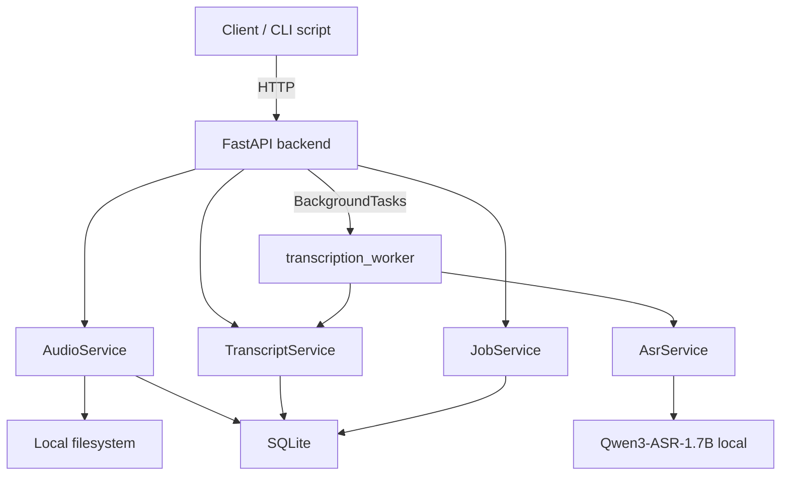

# Architecture

Finch follows a **transcript-first** design: audio becomes a transcript locally; LLM-generated documents are optional derivatives (not yet implemented).

```txt
Audio → Transcript → Document(s)   [Documents: planned]
```

## High-level view



## Core principle

- **ASR is local.** Audio never leaves the machine for transcription.
- **Transcript is source of truth.** Edits are stored separately (`editedText`).
- **LLM is optional** (Milestone 8+). Only transcript text would go to OpenRouter.

## Data model

```txt
AudioAsset
  ↓
Transcript
  ↓
Document (not implemented)
```

| Entity | Purpose |
|--------|---------|
| `AudioAsset` | Uploaded or recorded file metadata + paths to original/normalized WAV |
| `Transcript` | `rawText` from ASR, optional `editedText`, status `draft` / `final` / `transcribing` |
| `Job` | Async work unit (`transcription`, `ai_action` later) with progress/stage |
| `Document` | LLM-generated Markdown (planned) |

Relationships:

- One `AudioAsset` → one or more `Transcript` jobs can be created (MVP creates one per job)
- One `Transcript` → many `Document`s (planned)

## Request flows

### Upload and normalize

```txt
POST /api/audio/upload
  → validate MIME + size
  → save original to data/audio/original/
  → ffmpeg → 16 kHz mono PCM WAV in data/audio/normalized/
  → persist AudioAsset
```

Normalization runs **synchronously on upload** so transcription only runs ASR.

### Transcription job

```txt
POST /api/transcripts { audioAssetId }
  → create Transcript placeholder (status=transcribing, empty rawText)
  → create Job (queued), resultId = transcript.id
  → BackgroundTasks → transcription_worker
       → load Qwen3-ASR (lazy)
       → transcribe normalized WAV
       → update Transcript (rawText, status=draft)
       → Job completed
```

On failure, the placeholder transcript is removed.

Client polls `GET /api/jobs/{id}` every ~1s (frontend; CLI script does the same).

### Long audio chunking

Files longer than 60 seconds are split into **45-second chunks** in `AsrService`. Each chunk is transcribed separately; results are joined. Chunk output is printed to the server log during processing.

## Storage

| Layer | Technology | Location |
|-------|------------|----------|
| Metadata | SQLite + SQLModel | `backend/finch.db` |
| Audio files | Filesystem | `backend/data/audio/original`, `.../normalized` |
| Model cache | Hugging Face cache | `backend/data/hf_cache` (configurable via `HF_HOME`) |
| Exports | Filesystem | `backend/data/exports` (reserved) |

## API surface (implemented)

| Method | Path | Description |
|--------|------|-------------|
| GET | `/api/health` | Liveness check |
| POST | `/api/audio/upload` | Upload + normalize |
| GET | `/api/audio/{id}` | Audio metadata |
| DELETE | `/api/audio/{id}` | Delete audio files + record |
| POST | `/api/transcripts` | Start transcription job; returns `jobId` + `transcriptId` |
| GET | `/api/transcripts` | List transcripts (summary) |
| GET | `/api/transcripts/{id}` | Full transcript |
| PATCH | `/api/transcripts/{id}` | Update title, editedText, status |
| DELETE | `/api/transcripts/{id}` | Delete transcript |
| GET | `/api/jobs/{id}` | Job status and progress |

Not implemented: `/api/ai-actions`, `/api/documents`.

## Error format

```json
{
  "error": {
    "code": "AUDIO_FILE_TOO_LARGE",
    "message": "Human readable message"
  }
}
```

## Technology stack

| Layer | Stack |
|-------|-------|
| Backend | FastAPI, uv, SQLModel, SQLite |
| ASR | `qwen-asr`, PyTorch, Qwen3-ASR-1.7B |
| Audio | ffmpeg, librosa |
| Frontend | Next.js 16, Tailwind v4, shadcn/ui, TanStack Query |
| LLM | OpenRouter (planned) |

## Frontend (implemented)


Key UX: upload/record flows poll jobs; transcript list auto-refreshes while any item has `status: transcribing`; record page shows a live waveform via Web Audio API.

## Deployment notes (MVP)

- Single process: FastAPI + in-process `BackgroundTasks` (no Redis/Celery)
- Job polling from clients (no WebSockets)
- CORS enabled for `http://localhost:3000` (Next.js frontend)
- Mock modes: `ASR_MOCK`, `LLM_MOCK` (LLM not wired yet)
