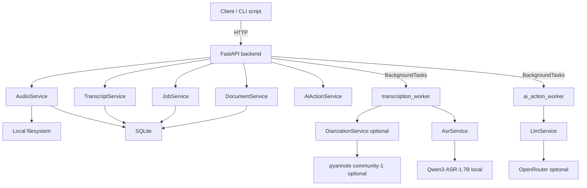

# Architecture

Finch follows a **transcript-first** design: audio becomes a transcript locally; LLM-generated documents are optional derivatives.

```txt
Audio → Transcript → Document(s)
```

## High-level view



## Core principle

- **ASR is local.** Audio never leaves the machine for transcription.
- **Diarization is local** when enabled (pyannote). Speaker labels are optional.
- **Transcript is source of truth.** Edits are stored separately (`editedText`).
- **LLM is optional.** Only transcript text is sent to OpenRouter for AI actions.

## Data model

```txt
AudioAsset
  ↓
Transcript
  ↓
Document
```

| Entity | Purpose |
|--------|---------|
| `AudioAsset` | Uploaded or recorded file metadata + paths to original/normalized WAV |
| `Transcript` | `rawText`, optional `editedText`, `speakerSegments`, `status` (`draft` / `final` / `transcribing` / `failed`) |
| `Job` | Async work unit (`transcription`, `ai_action`) with progress/stage |
| `Document` | LLM-generated Markdown linked to a transcript |

## Request flows

### Upload and normalize

```txt
POST /api/audio/upload
  → validate MIME + size (mp3, wav, webm, m4a, …)
  → save original to data/audio/original/
  → ffmpeg → 16 kHz mono PCM WAV in data/audio/normalized/
  → persist AudioAsset
```

### Transcription job

When `DIARIZATION_ENABLED=true`:

```txt
POST /api/transcripts { audioAssetId }
  → create Transcript placeholder (status=transcribing)
  → create Job, resultId = transcript.id
  → transcription_worker
       → optional: pyannote diarization → speaker segments
       → Qwen3-ASR per segment (or full file if diarization off/fallback)
       → update Transcript (rawText, speakerSegments, status=draft)
       → Job completed
```

On failure, the transcript is kept with `status=failed` and `errorMessage` (not deleted).

If diarization is enabled but unavailable (missing HF access, etc.), the worker falls back to full-file ASR and stores a `processingNote` on the transcript.

Segment tuning (`DIARIZATION_MIN_SEGMENT_SECONDS`, `DIARIZATION_MERGE_GAP_SECONDS`, `DIARIZATION_MAX_SEGMENTS`) is applied after pyannote. See [diarization.md](diarization.md).

### AI action job

```txt
POST /api/ai-actions { transcriptId, action }
  → Job (ai_action)
  → ai_action_worker → LlmService (OpenRouter or LLM_MOCK)
  → create Document
```

## Storage

| Layer | Technology | Location |
|-------|------------|----------|
| Metadata | SQLite + SQLModel | `backend/finch.db` |
| Audio files | Filesystem | `backend/data/audio/original`, `.../normalized` |
| Model cache | Hugging Face cache | `HF_HOME` (default `./data/hf_cache`) |
| Exports | Filesystem | `backend/data/exports` (reserved) |

Config loads from `backend/.env` and repo root `.env`.

## API surface

| Method | Path | Description |
|--------|------|-------------|
| GET | `/api/health` | Liveness + capability flags (ASR/diarization/LLM) |
| POST | `/api/audio/upload` | Upload + normalize |
| GET/DELETE | `/api/audio/{id}` | Audio metadata / delete |
| POST | `/api/transcripts` | Start transcription job |
| GET/PATCH/DELETE | `/api/transcripts/{id}` | Transcript CRUD |
| GET | `/api/jobs/{id}` | Job status and progress |
| GET/POST | `/api/ai-actions/...` | AI action templates + jobs |
| GET/PATCH/DELETE | `/api/documents/{id}` | Document CRUD |

## Startup diagnostics

On boot, the backend logs a configuration summary: loaded env files, ASR/diarization/LLM mode, dependency checks (ffmpeg, torch, pyannote-audio), and remediation steps when something is missing. See `app/core/startup_diagnostics.py`.

## Technology stack

| Layer | Stack |
|-------|-------|
| Backend | FastAPI, uv, SQLModel, SQLite |
| ASR | `qwen-asr`, PyTorch, Qwen3-ASR-1.7B |
| Diarization | `pyannote-audio`, `pyannote/speaker-diarization-community-1` |
| Audio | ffmpeg, librosa |
| Frontend | Next.js 16, Tailwind v4, shadcn/ui, TanStack Query |
| LLM | OpenRouter (`LLM_MOCK` for development) |

## Deployment notes (MVP)

- Single process: FastAPI + in-process `BackgroundTasks` (no Redis/Celery)
- Job polling from clients (no WebSockets)
- CORS enabled for `http://localhost:3000`
- Mock modes: `ASR_MOCK`, `DIARIZATION_MOCK`, `LLM_MOCK`
